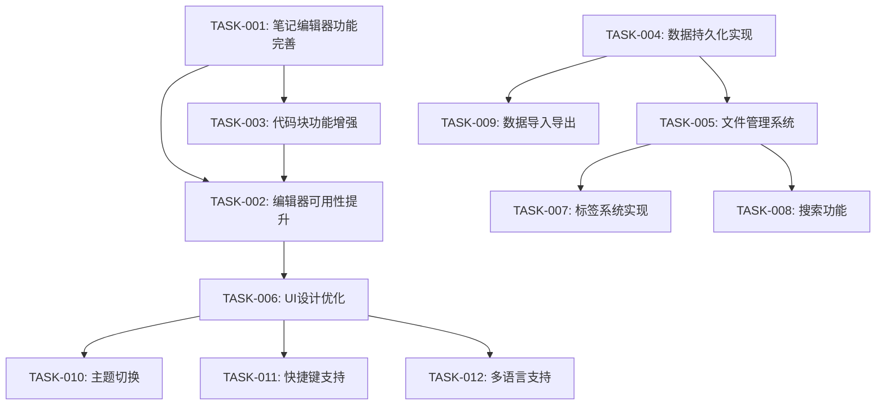

# 笔记本应用任务概述

## 任务依赖关系图

## 任务列表

| 任务ID | 任务名称 | 优先级 | 复杂度 | 工作量 | 依赖任务 | 状态 |
|--------|---------|-------|--------|--------|---------|------|
| TASK-001 | 笔记编辑器功能完善 | 高 | 中 | 大 | - | 进行中 |
| TASK-002 | 编辑器可用性提升 | 高 | 中 | 大 | TASK-001, TASK-003 | 进行中 |
| TASK-003 | 代码块功能增强 | 高 | 中 | 中 | TASK-001 | 进行中 |
| TASK-004 | 数据持久化实现 | 高 | 高 | 大 | - | 未开始 |
| TASK-005 | 文件管理系统 | 中 | 中 | 中 | TASK-004 | 未开始 |
| TASK-006 | UI设计优化 | 中 | 低 | 中 | TASK-002 | 未开始 |
| TASK-007 | 标签系统实现 | 低 | 低 | 小 | TASK-005 | 未开始 |
| TASK-008 | 搜索功能 | 低 | 中 | 中 | TASK-005 | 未开始 |
| TASK-009 | 数据导入导出 | 低 | 中 | 中 | TASK-004 | 未开始 |
| TASK-010 | 主题切换 | 低 | 低 | 小 | TASK-006 | 未开始 |
| TASK-011 | 快捷键支持 | 低 | 低 | 小 | TASK-006 | 未开始 |
| TASK-012 | 多语言支持 | 低 | 中 | 中 | TASK-006 | 未开始 |

## 任务优先级分析

### 高优先级任务
- **TASK-001: 笔记编辑器功能完善**
  - 核心功能，用户体验的基础
  - 影响后续所有编辑器相关功能

- **TASK-002: 编辑器可用性提升**
  - 提升用户编辑体验
  - 依赖基础编辑器功能完善

- **TASK-003: 代码块功能增强**
  - 针对开发者用户的重要功能
  - 是编辑器可用性的重要组成部分

- **TASK-004: 数据持久化实现**
  - 应用数据存储的基础
  - 影响用户数据安全性和可靠性

### 中优先级任务
- **TASK-005: 文件管理系统**
  - 提升用户组织笔记的能力
  - 依赖于数据持久化实现

- **TASK-006: UI设计优化**
  - 提升整体用户体验
  - 在核心功能稳定后进行

### 低优先级任务
- **TASK-007 ~ TASK-012**
  - 增强功能，在基础功能稳定后实现
  - 可根据用户反馈调整优先级

## 任务复杂度分析

### 高复杂度任务
- **TASK-004: 数据持久化实现**
  - 需要同时支持SQLite和localStorage两种模式
  - 涉及数据同步和迁移机制

### 中复杂度任务
- **TASK-001: 笔记编辑器功能完善**
- **TASK-002: 编辑器可用性提升**
- **TASK-003: 代码块功能增强**
- **TASK-005: 文件管理系统**
- **TASK-008: 搜索功能**
- **TASK-009: 数据导入导出**
- **TASK-012: 多语言支持**

### 低复杂度任务
- **TASK-006: UI设计优化**
- **TASK-007: 标签系统实现**
- **TASK-010: 主题切换**
- **TASK-011: 快捷键支持**

## 实施计划

### 第一阶段（1-2个月）
- 完成TASK-001, TASK-003, TASK-004
- 开始TASK-002

### 第二阶段（3-4个月）
- 完成TASK-002, TASK-005, TASK-006
- 开始TASK-008, TASK-009

### 第三阶段（5-6个月）
- 完成TASK-007 ~ TASK-012
- 全面测试和优化

## 风险评估

| 风险描述 | 可能性 | 影响程度 | 缓解措施 |
|---------|-------|---------|---------|
| 编辑器功能与性能平衡 | 高 | 高 | 实现懒加载和虚拟滚动，分段渲染大文档 |
| 数据同步冲突 | 中 | 高 | 设计合理的冲突解决机制，保留历史版本 |
| 跨平台兼容性问题 | 中 | 中 | 全面测试主流平台，添加兼容性处理代码 |
| 功能过多导致界面复杂 | 高 | 中 | 采用分组和折叠式工具栏，保持界面简洁 |
| 开发资源不足 | 中 | 高 | 合理规划任务优先级，按重要性分配资源 |

---

*最后更新：2023-11-30* 